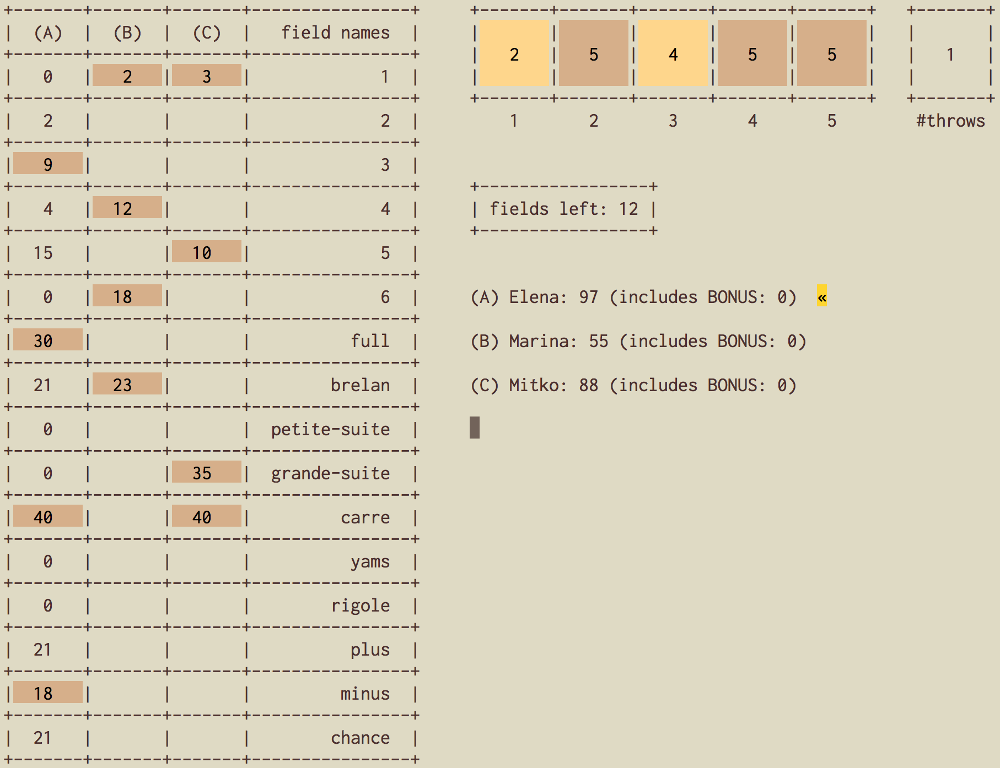

# Yahtzee

The [Yahtzee](https://en.wikipedia.org/wiki/Yahtzee) game.

The image is from a game with three players.

# Installation:

Ensure that `yahtzee.el` is in a directory on your load-path, and add `(require 'yahtzee)`
to your `~/.emacs` or `~/.emacs.d/init.el`.

# How to play:

- `M-x yahtzee` start a game
- `C-n`         add players
- `C-r`         reset players
- `SPC`         throw dice
- `{1,2,3,4,5}` hold outcome of `{1,2,3,4,5}`-th dice
- `UP/DOWN`     select score to register
- `ENTER`       register selected score
- `w`           save the game (in json format)

The score of a saved game can be loaded using `M-x yahtzee-load-game-score`.

# Notes

Personally I don't like playing with "Yahtzee bonuses" and "Joker rules"
so they are not implemented (even thought they are simple to include).
I use only one bonus (see `yahtzee-compute-bonus`). Furthermore, note
that some scores differ from the official ones. Changing all this can
be done by simply modifying the corresponding functions in the
definition of `yahtzee-fields-alist`.
